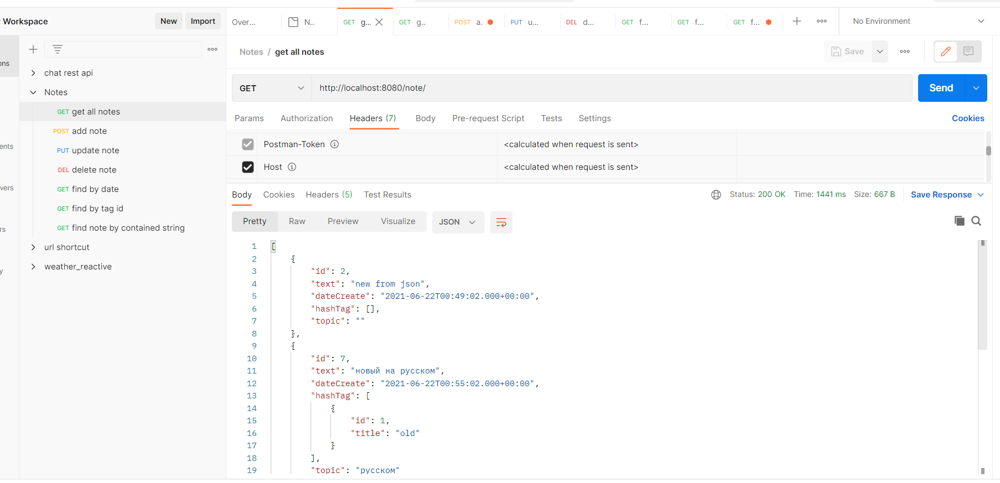
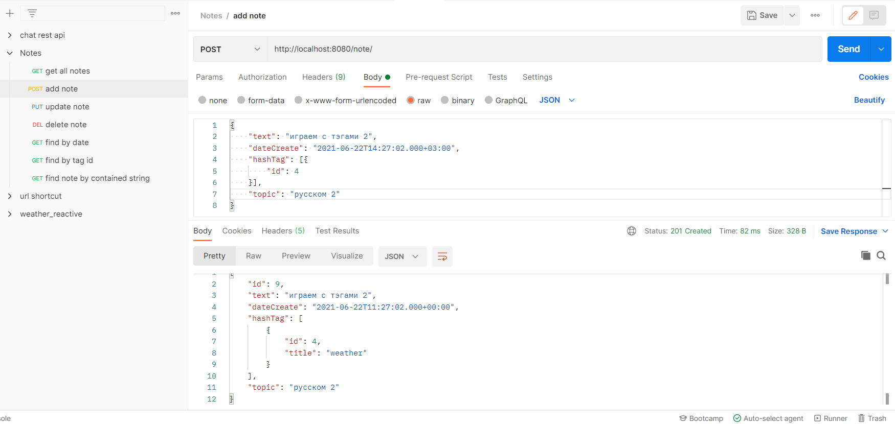
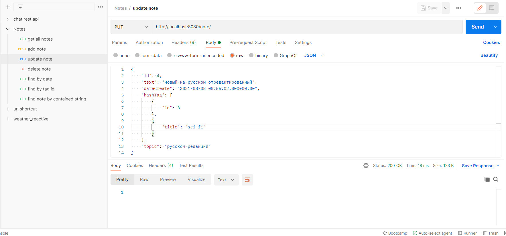
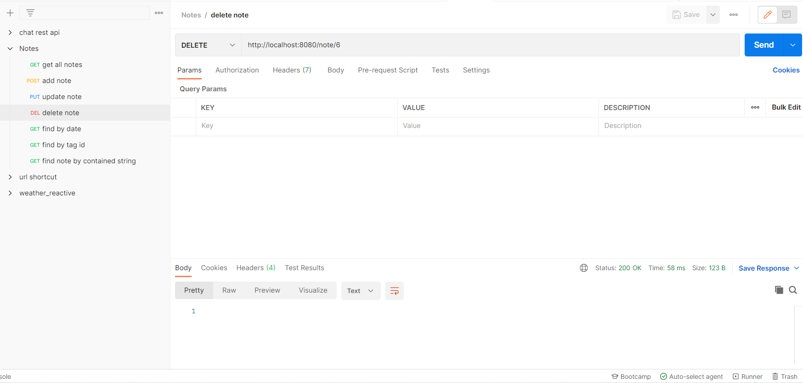
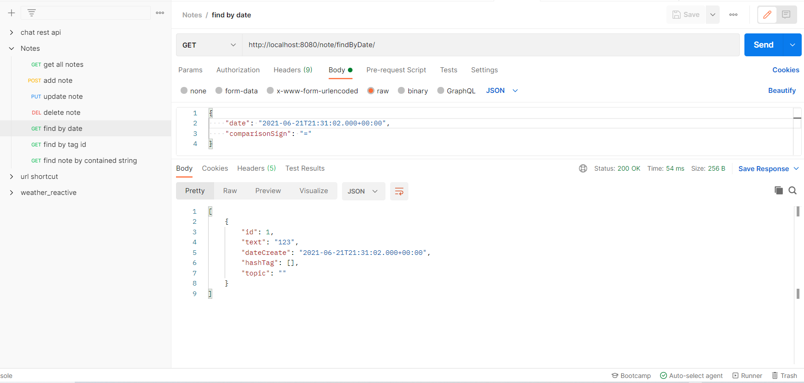
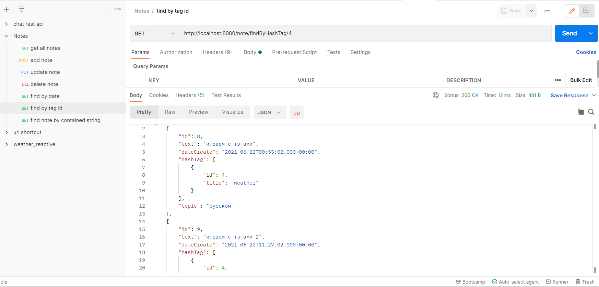
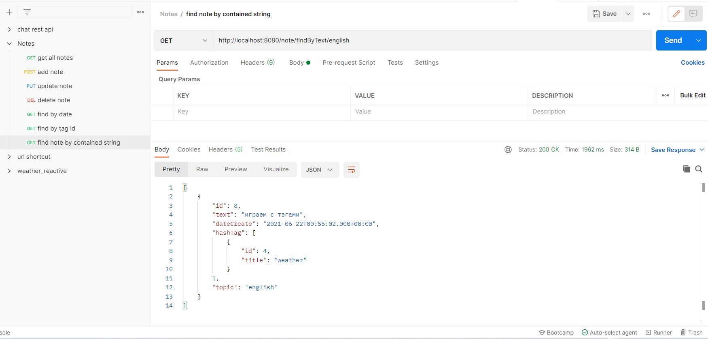

### Задание
Реализовать приложение "Заметки"
Приложение имеет следующие функции
1) добавление заметки
2) удаление заметки
3) редактирование заметки
4) просмотр списка заметок с фильтрацией по дате или хэш-тегу.
5) поиск заметок по подстроке по принципу "содержит" (поиск должен искать по тексту и по названию заметки)

Пользователь имеет возможность создавать произвольное кол-во заметок.
Созданные заметки должны быть доступны после перезапуска приложения (т.е. сохраняться в каком-то постоянном хранилище).

Параметры Заметки
Обязательные:
    - текст заметки;
    - дата создания;
Необязательные:
    - список хэш-тегов;
    - название;

Приложение можно реализовать как консольное, так и ввиде REST API. Для сборки приложения использовать Maven.
Не использовать Spring Data
Аутентификацию/авторизацию реализовывать не требуется.

Будет плюсом:
- unit-тесты
- javadoc
- краткая инструкция по использованию

### Конфигурирование

- необходимо создать базу данных notes (Postgresql), схема создаться автоматически при первом запуске
- сконфигурировать подключение к бд(url, username, password): 
    1) src/main/resources/application.properties
    2) src/main/resources/hibernate.cfg.xml
- программа работает через REST API 

Примеры запросов

